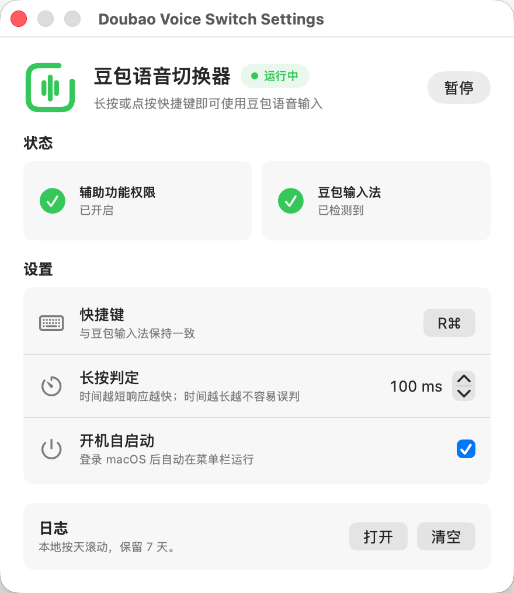

# Doubao Voice Switch

豆包语音切换器是一个 macOS 菜单栏小工具。用户通过豆包输入法的语音快捷键完成语音输入后，本应用会将系统输入法恢复到语音输入前的状态。

## 关于

这是一个使用 Codex 协作开发的纯 vibe coding 项目。需求、调试、UI 调整和实现都通过自然语言迭代完成。

## 截图



## 功能

- 菜单栏常驻运行
- 监听用户配置的豆包语音快捷键
- 记录语音输入前的原输入法
- 在豆包语音输入结束后恢复原输入法
- 展示辅助功能权限和豆包输入法检测状态
- 使用与豆包全局语音快捷键一致的快捷键配置
- 支持开机自启动
- 本地日志按天滚动，保留 7 天

## 使用

1. 安装并启用豆包输入法。
2. 在豆包输入法设置中打开语音输入的全局快捷键。
3. 将豆包语音全局快捷键设置为希望使用的组合键，**长按与短按的快捷键需要设置为一个快捷键**。
4. 打开 Doubao Voice Switch，在系统设置中授予辅助功能权限。
5. 在本软件设置页把快捷键设置为与豆包语音全局快捷键完全一致。
6. 使用该快捷键完成豆包语音输入。

## 日志

日志保存在用户目录的应用支持目录中，按天滚动并默认保留 7 天。日志用于排查快捷键监听、豆包语音输入状态和输入法恢复结果。

## 开发

运行核心行为测试：

```bash
rtk swift run DoubaoVoiceSwitchCoreBehaviorTests
```

构建：

```bash
rtk swift build
```

检查 diff：

```bash
rtk git diff --check
```

运行并打包本地 app：

```bash
rtk ./script/build_and_run.sh --verify
```
