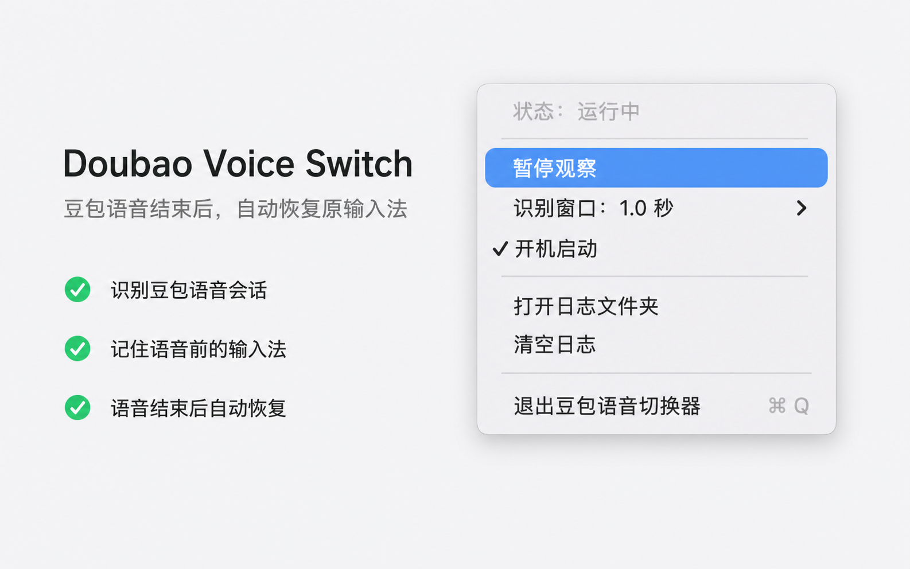

# Doubao Voice Switch

豆包语音切换器是一个 macOS 菜单栏小工具。用户通过豆包输入法的语音快捷键完成语音输入后，本应用会将系统输入法恢复到语音输入前的状态。

## 关于

这是一个使用 Codex 协作开发的纯 vibe coding 项目。需求、调试、UI 调整和实现都通过自然语言迭代完成。

## 截图



## 功能

- 菜单栏常驻运行
- 观察输入法切换和豆包语音输入状态
- 记录语音输入前的原输入法
- 在豆包语音输入结束后恢复原输入法
- 支持调整语音启动识别窗口
- 展示运行状态和豆包输入法检测异常
- 支持开机自启动
- 本地日志按天滚动，保留 7 天

## 使用

1. 安装并启用豆包输入法。
2. 在豆包输入法设置中打开语音输入的全局快捷键。
3. 打开 Doubao Voice Switch，并根据豆包启动速度调整语音启动识别窗口。
4. 使用豆包的全局快捷键完成语音输入。

本应用不需要辅助功能或输入监控权限。识别窗口越短，越不容易把手动切换识别为语音会话，但可能漏掉较慢的豆包冷启动；识别窗口越长，结果相反。

## 日志

日志保存在用户目录的应用支持目录中，按天滚动并默认保留 7 天。日志用于排查输入法切换、豆包语音输入状态和输入法恢复结果。

## 开发

运行核心行为测试：

```bash
swift run DoubaoVoiceSwitchCoreBehaviorTests
```

构建：

```bash
swift build
```

检查 diff：

```bash
git diff --check
```

运行并打包本地 app：

```bash
./script/build_and_run.sh --verify
```
